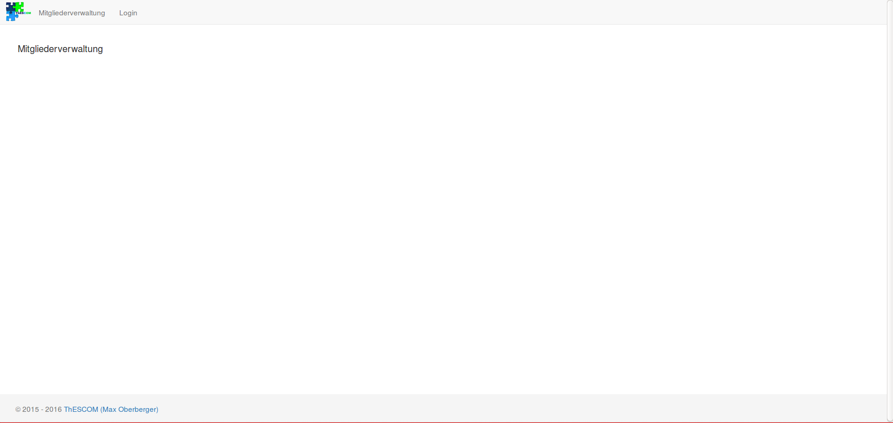
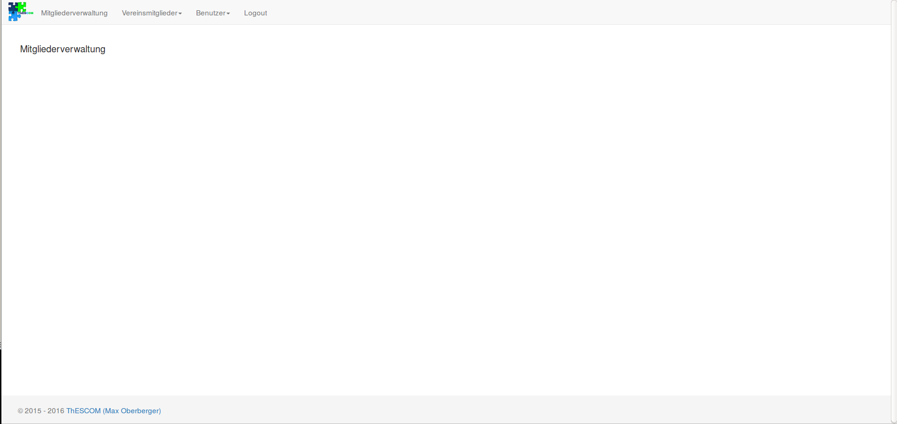

# License

This files are free software: you can redistribute it and/or modify
it under the terms of the GNU General Public License as published by
the Free Software Foundation, either version 3 of the License, or
(at your option) any later version.

This program is distributed in the hope that it will be useful,
but WITHOUT ANY WARRANTY; without even the implied warranty of
MERCHANTABILITY or FITNESS FOR A PARTICULAR PURPOSE. See the
GNU General Public License for more details.

You should have received a copy of the GNU General Public License
along with this program. If not, see <http://www.gnu.org/licenses/>.

* * *

1. Introduction
===============
Every club needs to handle its members. But how? I don't really like all these
excel sheets or commercial solutions. What about an Open-Source web application
which can be easily used?!

The default language for the output strings are in German, because I developed
this program for a German Club.

2. Functions
===============
What can you do with this application?

- add new club members
- give access to members who needs to view the list/bank data of your members
- add some information on the start page or on the first page which can be seen
after login

3. How it works
===============

Without any login you see the default start page with the login menu part on top:

After pressing the login menu part, you see the login-mask where you login with
email and password. Default:  
**Email**: foo@bar.de  
**Pwd**:testPassword

After the login you can choose between two different options (Benutzer and
Vereinsmitglieder)

